# VOICEBOUND

*A story that listens back — and paints itself around you.*

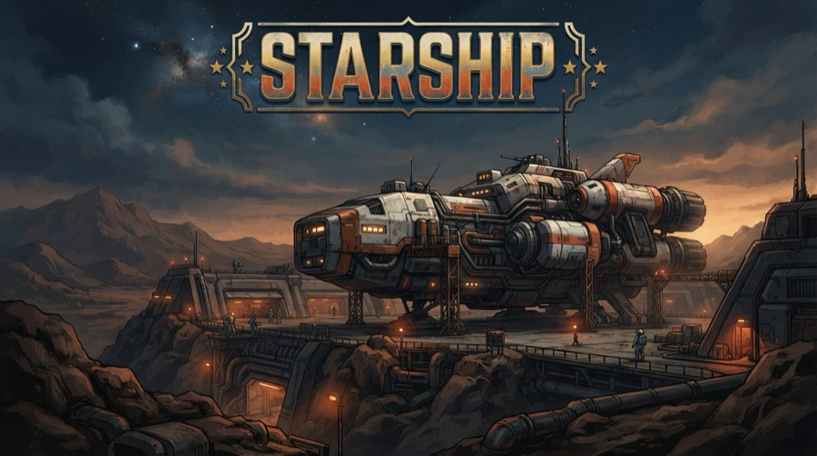

**Voicebound** is a live, voice-first interactive fiction game (think *Bandersnatch* / *As Dusk Falls*) where nothing is pre-rendered: a live AI narrator you can interrupt mid-sentence, characters with their own real voices, and a visual world that is **generated, in volume, in real time** — because the entire game is built on the premise that image generation is no longer slow or expensive.

**Play:** https://web-production-f59b2.up.railway.app (installable PWA)

---

## Problem Statement 3 — High-Throughput Creative Workflows with NB2 Lite

> *"Show us automated, programmatic pipelines… or interactive storytelling canvases where real-time, high-volume generation is load-bearing to the user experience."*

Voicebound is that storytelling canvas. NB2 Lite (`gemini-3.1-flash-lite-image`) is not a feature here — it is the **rendering engine of the game**. Every pixel of story art is generated by programmatic pipelines with zero human prompting:

### ⚒ The World Forge — 50 assets, 32 seconds, one pipeline

The moment you create your character, a manifest generator (Gemini 3.5 Flash, structured output) expands the story outline into a full production asset list, and a **concurrency-10 pipeline** forges the story's entire visual world before you've finished reading your stat sheet:

| Measured on a real run | |
|---|---|
| Assets generated | **50 / 50, zero failures** |
| Wall time | **32.0s** (≈220s of aggregate generation, 10-way parallel) |
| Cost | **≈ $0.002 per story** at $0.034/1k images |
| Breakdown | 16 beat scenes · 8 locations · 15 props · 4 protagonist poses · title + 3 ending cards · 3 NPC portraits |

The player *watches* the forge fill a live gallery, then meets those assets again all through play — an in-game **codex** keeps the collection browsable.

| Scene | Location | Prop | NPC portrait | Protagonist pose |
|---|---|---|---|---|
| 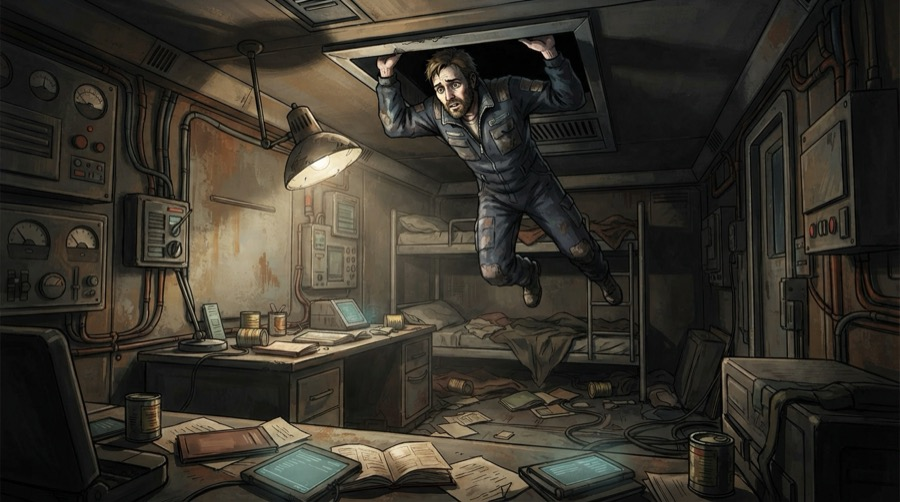 | 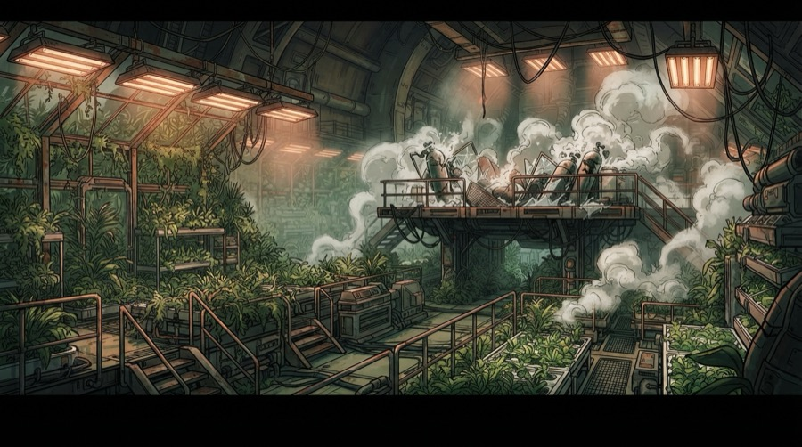 | 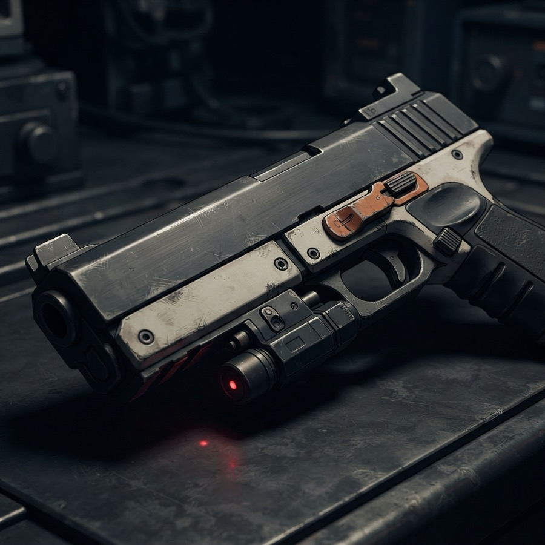 | 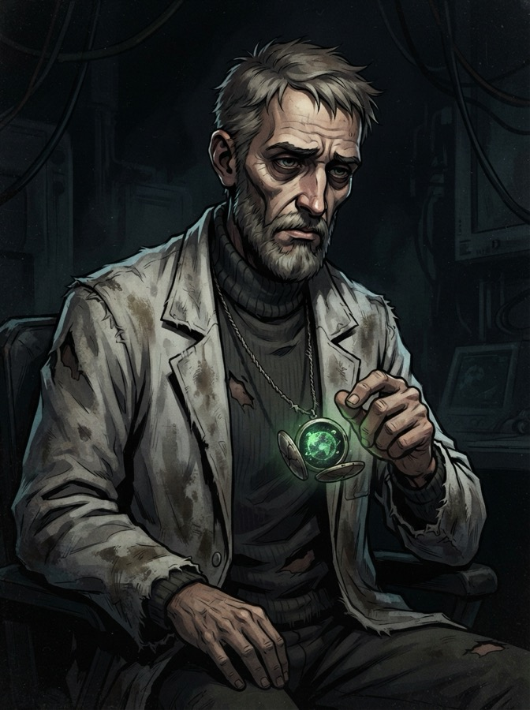 | 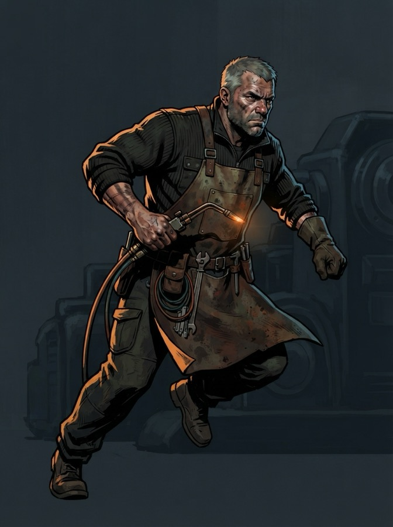 |

### Where high-volume generation is load-bearing (not decorative)

- **Every scene is painted live** as the narrator speaks (~4s/frame), with a **two-lane semaphore**: audio plays strictly ordered while scene frames ride *visual markers on the audio timeline* — a 30-second narration with five scene changes shows all five, each landing in sync with the words being heard, generation running fully parallel underneath.
- **Speculative branch pre-rendering** — when choices appear, all 2–4 branches render in parallel *while you decide*; your pick's frame swaps in instantly. Waste is free at NB2 Lite prices.
- **Predictive beat prefetch** — after every turn, the beats the story can reach next pre-paint in the background.
- **You are in the art** — a selfie becomes a stylized portrait (likeness preserved) that rides as a reference image on every frame you appear in; NPC portraits and location shots anchor character and place consistency shot-to-shot:

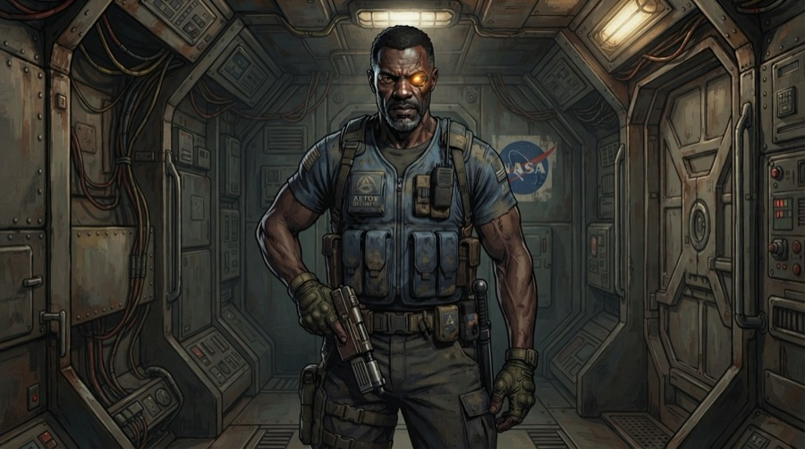

- **Same-scene edits** — when a moment continues in one location, NB2 Lite *edits* the previous frame ("the door is now open") instead of regenerating: frame-to-frame continuity like panels in a spread.
- **Generative UI & typography** — inventory panels, stat blocks and diegetic HTML artifacts (wanted posters, terminals) generate on demand; the title and ending cards showcase NB2 Lite's high-fidelity text rendering (see the header image — that typography is generated).
- **Even the app icon** came out of the pipeline (`scripts/gen-app-assets.ts`): 

---

## The rest of the game (PS1 — Real-Time Multimodal Interaction)

The narrator is a **Gemini Live API** session over a direct browser↔Google WebSocket: continuous audio, natural barge-in (interrupt mid-sentence and it reacts in character), and vocal-tone awareness — deliver a bluff *in your bluffing voice* and your d20 roll gets advantage. This cannot work typed into a chatbox: tone, interruption, and timing are the mechanics.

- **Full cast with real voices** — every character has a stored voice ID; the narrator delegates each dialogue line through a `speak_as` tool to per-line TTS synthesis, sequenced into the same audio pipeline with speaker chips on screen. The player's own moves are voiced in *their* character's voice.
- **D&D layer** — Might/Wit/Charm stats read from your photo, animated d20 skill checks (advantage from persuasive delivery), QTE fights (mash / timed / sequence) where **losing is a branch, not a game over**.
- **Living social fabric** — a Director agent reads every turn: continuity guard (dead NPCs stay dead), relationship/aura deltas from *how* you speak, and style enforcement.
- **Save anywhere** — every beat persists to Postgres; resume on any device with an in-fiction recap.
- **Story cartography** — a synthetic player population (5 personas simulated per story) powers *As Dusk Falls*-style post-chapter maps: "68% went quietly — you fought."

| Home (PWA) | Character forge | Your journey (mobile) | Story cartography |
|---|---|---|---|
| 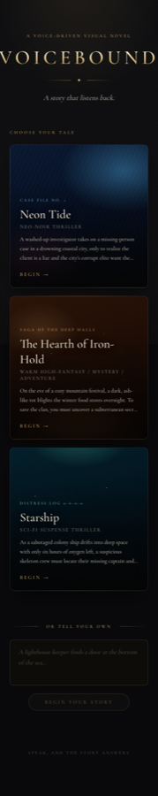 | 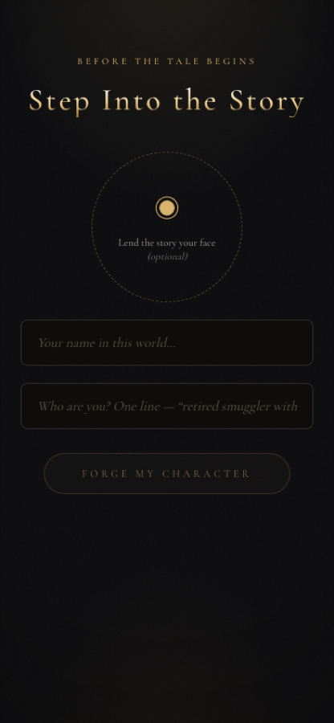 | 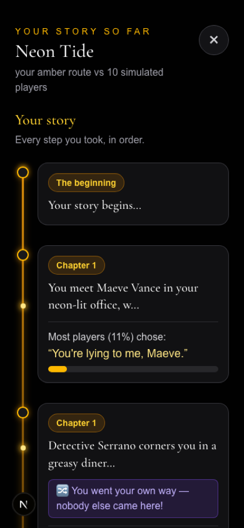 | 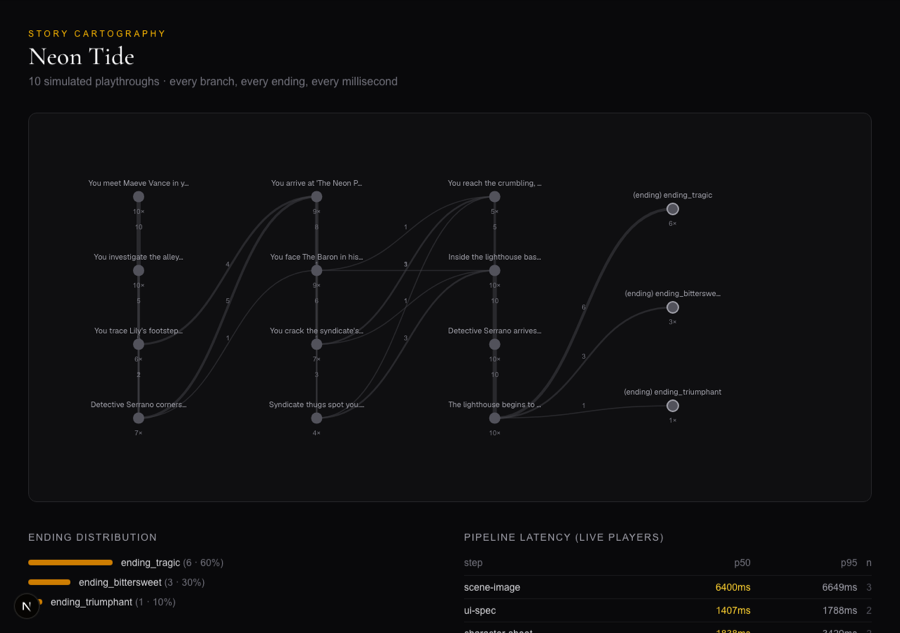 |

---

## How the AI models divide the work

| Agent | Model | Job |
|---|---|---|
| **Artist / World Forge** | `gemini-3.1-flash-lite-image` (NB2 Lite) | ALL imagery: 50-asset forge, live scenes, edits, portraits, cards, icons — the PS3 core |
| **Narrator** | `gemini-3.1-flash-live-preview` (Live API) | Voice GM: narration, tone reading, tool calls, barge-in |
| **Cast voices** | `gemini-3.1-flash-tts-preview` | Per-character dialogue synthesis (16-voice pool, stored per character) |
| **Director** | `gemini-3.5-flash` | Continuity guard, social read, missed-tool fill, mood detection — supervises every turn |
| **Story brain** | `gemini-3.5-flash` | Outline generation (structured), asset manifests, summaries, generative UI specs & HTML artifacts |
| **Simulator** | `gemini-3.5-flash` | Plays each story as 5 personas → branch analytics + latency benchmarks |
| **Composer** | `lyria-3-clip-preview` | 7-mood × 2-arrangement music banks per story, ducked under dialogue |

## Architecture in one paragraph

Next.js 16 on Railway with Postgres (all generated assets stored as immutable rows). The browser opens the Live WebSocket **directly to Google** using single-use ephemeral tokens minted server-side with the full session config locked in `liveConnectConstraints` — the API key never leaves the server and the client can't alter the system prompt. The narrator drives the game through seven function-calling tools (`render_scene`, `present_choices`, `speak_as`, `start_qte`, `skill_check`, `show_ui`, `update_state`, `end_story`); the client executes them through a **presentation queue** (one ordered pipeline for narrator audio, character voice clips, and visual markers) while all image context — player portrait, NPC portraits, location anchors, previous frame — is assembled **server-side** so every generation receives accurate reference inputs. Telemetry wraps every model call; the analytics page shows live p50/p95 per pipeline step.

## Run it

```bash
npm install
echo "GEMINI_API_KEY=..." > .env         # required
echo "DATABASE_URL=postgres://..." >> .env   # optional; prebuilt stories play without it
npx drizzle-kit push
npm run dev
```

Useful scripts: `scripts/simulate.ts` (persona playthroughs → analytics), `scripts/gen-outlines.ts`, `scripts/gen-music.ts`, `scripts/gen-app-assets.ts`, `scripts/e2e-play.ts` (headless full playthrough against any deployment).
